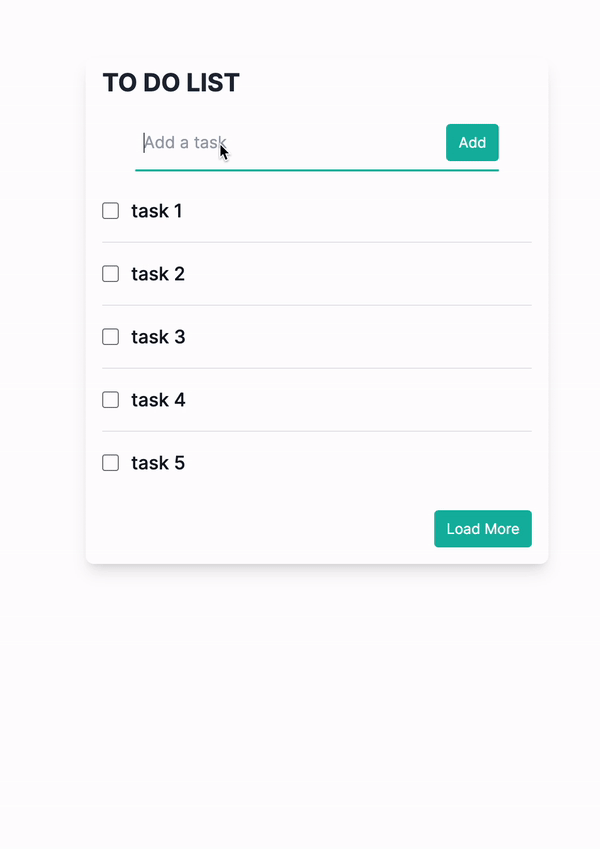

Built as part of an exploration of using Go with NextJS on Vercel: https://jordanwebster.com/articles/should-you-use-go-with-nextjs-on-vercel

# NextJS + Go Starter Project
A basic todo app to kickstart your NextJS 14 (App Router) and Go app, leveraging the ent framework for the data model and relay for data dependencies. It is designed to work out the box with Vercel hosting and serverless functions (providing your configuration, see below), but there is also a playground package you could deploy and run independently if you wanted instead.



## Get Started
1. Clone the repo
2. Ensure the [Vercel CLI](https://vercel.com/docs/cli) is installed
3. Create a `.env.local` file with the following environment variables:
```bash
NEXT_PUBLIC_GRAPHQL_ENDPOINT="http://localhost:3000/api/graphql"
DATABASE_URL=<your_dev_database_url>
```
> **_NOTE:_** If using a database other than MySQL you will need to add the corresponding database driver and update the calls to `ent.Open`
4. Set the `DATABASE_URL` environment variable and run `go run go/cmd/db/migrate.go` to create/update the database tables
> **_NOTE:_** I recommend using the [dotenv CLI](https://www.npmjs.com/package/dotenv-cli) to load the environment variables from the `.env.local` in the previous step: `dotenv -e .env.local go run go/cmd/db/migrate.go`
5. Run `vercel dev`

## Updating Schema
Relay depends on a schema file being generated by ent. If you make any changes to your data model, run the app with `vercel dev` then you can run `npm run schema` to update the schema with the latest changes from ent.

## Database Migrations
For production you probably want to use versioned migrations. See the docs at https://entgo.io/docs/versioned-migrations.

If you want a simple automatic migration for your dev db, then you can run the `go/cmd/db/migrate.go` package.
> **_NOTE:_** My migration has foreign keys disabled because I was using Planetscale to host the DB which does not support foreign keys. Unless using Planetscale, you will want to [remove this](https://entgo.io/docs/migrate/#foreign-keys).
